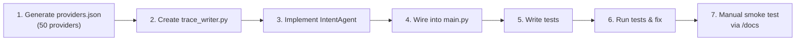

# Phase 1 — Mock Data + Intent Agent

Build the foundational data layer and first LLM-powered agent for ServiceWala.

---

## User Review Required

> [!IMPORTANT]
> **LLM SDK choice:** Using `google-genai` SDK directly (not ADK's `LlmAgent`). The roadmap says "ADK agent", but Phase 1's Intent Agent is a straightforward single-LLM call with JSON-mode output. Using `google.genai.Client.models.generate_content()` with `response_mime_type="application/json"` + a Pydantic `response_schema` gives us strict typing, reliable output, and clean trace data. We can wrap it in an ADK `LlmAgent` in a later phase when multi-agent orchestration actually matters. **Please confirm this approach or tell me to use ADK's LlmAgent wrapper instead.**

> [!WARNING]
> **Trace timestamps use UTC.** Trace filenames will be `intent_20260515T120530Z.json`. This keeps filenames sortable and timezone-unambiguous. If judges expect local PKT timestamps, let me know.

## Open Questions

1. **Available slots format** — The roadmap says "next 7 days, 3–8 slots per provider." Should slots be ISO datetimes (e.g., `"2026-05-16T09:00:00+05:00"`) or human-readable strings (e.g., `"Fri 16 May, 9 AM"`)? **My default: ISO datetimes** so the Ranking Agent can do time arithmetic later.

2. **Price range format** — Should `price_range` be a string like `"2000-5000"` or a structured object like `{"min": 2000, "max": 5000, "currency": "PKR"}`? **My default: structured object** for machine-readability.

3. **Test execution** — I'll add `pytest` and `pytest-asyncio` to `requirements.txt`. Tests will be runnable with `.venv\Scripts\python.exe -m pytest tests/ -v`. Confirm this is acceptable.

---

## Proposed Changes

### Mock Data

#### [MODIFY] [providers.json](file:///d:/Infromal%20Economy/mock_data/providers.json)

Replace the empty `[]` with a hand-crafted array of exactly 50 provider objects. Distribution:

| Category | Count | Sectors (primary) |
|---|---|---|
| AC Technician | 12 | G-13, G-11, F-10, I-8, Blue Area, DHA Phase 2 |
| Plumber | 10 | G-11, F-11, I-10, DHA Phase 2 |
| Electrician | 10 | F-10, F-11, I-8, G-13, Blue Area |
| Tutor | 10 | F-10, F-11, G-13, I-10 |
| Beautician | 8 | G-11, DHA Phase 2, F-10, Blue Area |

Each entry schema:
```json
{
  "id": "P0001",
  "name": "Muhammad Irfan",
  "category": "AC Technician",
  "sector": "G-13",
  "lat": 33.6350,
  "lng": 73.0290,
  "rating": 4.6,
  "rating_count": 132,
  "price_range": {"min": 2000, "max": 5000, "currency": "PKR"},
  "available_slots": ["2026-05-16T09:00:00+05:00", ...],
  "verified": true,
  "languages_spoken": ["Urdu", "Punjabi"],
  "_synthetic": true
}
```

**Intentional realism baked in:**
- **P0017** — rating `2.1`, low `rating_count` (9). Tests that Ranking Agent doesn't blindly sort by rating.
- **P0033** — `available_slots: []` for next 24h (all slots start from day-after-tomorrow). Tests availability filtering.
- **P0008 & P0029** — overlapping expertise: an "Electrician" who also does AC work (noted in a `notes` field), and a "Plumber" with electrical background.
- **P0041** — name "Noor Electric" but category is "Beautician". Tests that matching uses `category`, not name heuristics.

Real coordinates for each sector (sourced from OpenStreetMap centroids):

| Sector | Lat | Lng |
|---|---|---|
| G-13 | 33.6350 | 73.0290 |
| G-11 | 33.6655 | 73.0185 |
| F-10 | 33.6940 | 73.0125 |
| F-11 | 33.6855 | 73.0295 |
| I-8 | 33.6640 | 73.0530 |
| I-10 | 33.6430 | 73.0220 |
| Blue Area | 33.7100 | 73.0480 |
| DHA Phase 2 Rwp | 33.5560 | 73.1120 |

---

### Intent Agent

#### [MODIFY] [intent_agent.py](file:///d:/Infromal%20Economy/backend/agents/intent_agent.py)

Replace the stub with a full implementation:

1. **`__init__`** — Instantiate `google.genai.Client(api_key=GOOGLE_API_KEY)`. Store `MODEL_NAME` from config.
2. **`_build_prompt(text)`** — Returns the system prompt + user text. The system prompt will:
   - Define the agent's role: "You are an intent-parsing agent for a service marketplace in Pakistan."
   - Specify the 5 valid `service_type` values.
   - Specify valid sector names.
   - Provide 5 few-shot examples (English, Roman Urdu, Urdu script — per roadmap).
   - Instruct on `needs_clarification` logic: set to `true` when service_type or location cannot be determined.
3. **`_build_schema()`** — Return the Pydantic model `IntentResult` to be used as `response_schema`.
4. **`run(text) -> dict`** — Call `client.models.generate_content()` with JSON mode, capture the raw response, parse it, write the trace, and return the parsed dict.

**Pydantic schema (`IntentResult`):**
```python
class IntentResult(BaseModel):
    service_type: str | None
    location_sector: str | None
    requested_time: str | None
    urgency: Literal["now", "today", "this_week", "flexible"]
    constraints: dict
    raw_input: str
    detected_language: Literal["english", "urdu", "roman_urdu"]
    confidence: float
    needs_clarification: bool
    clarification_question: str | None
```

---

### Trace Writer

#### [NEW] [trace_writer.py](file:///d:/Infromal%20Economy/backend/services/trace_writer.py)

A dedicated module for writing judge-readable trace files.

```python
def write_intent_trace(
    user_input: str,
    prompt_sent: str,
    raw_llm_response: str,
    parsed_output: dict,
    model_name: str,
    latency_ms: float,
) -> str:  # returns the trace file path
```

**Trace file format** (`trace/intent_20260515T120530Z.json`):

```json
{
  "trace_type": "intent_agent",
  "timestamp": "2026-05-15T12:05:30Z",
  "model": "gemini-2.5-flash",
  "latency_ms": 842,
  "input": {
    "user_text": "Mujhe kal subah G-13 mein AC technician chahiye"
  },
  "prompt_sent_to_llm": "You are an intent-parsing agent for a service marketplace...\n\nUser input: Mujhe kal subah G-13 mein AC technician chahiye",
  "raw_llm_response": "{\"service_type\": \"AC Technician\", ...}",
  "parsed_output": {
    "service_type": "AC Technician",
    "location_sector": "G-13",
    "...": "..."
  },
  "summary": "✅ Parsed Roman Urdu request → AC Technician in G-13, tomorrow morning, confidence 0.95"
}
```

The `summary` line is generated programmatically: `"✅ Parsed {language} request → {service_type} in {sector}, {time}, confidence {conf}"` (or `"⚠️ Needs clarification: {question}"` when ambiguous).

---

### Config Update

#### [MODIFY] [config.py](file:///d:/Infromal%20Economy/backend/config.py)

No changes needed — `MODEL_NAME` already defaults to `"gemini-2.5-flash"` and `GOOGLE_API_KEY` is already wired. ✅

---

### API Wiring

#### [MODIFY] [main.py](file:///d:/Infromal%20Economy/backend/main.py)

1. **Import** `IntentAgent` from `backend.agents`.
2. **Instantiate** `intent_agent = IntentAgent()` at module level.
3. **Update `ServiceResponse`** model to include `intent: dict | None` and `trace_file: str | None`.
4. **Update `handle_request`** to:
   - Call `intent = await intent_agent.run(request.query)`
   - Return the parsed intent and the trace file path
   - Wrap in try/except for graceful error handling

Updated response shape:
```json
{
  "status": "ok",
  "message": "Intent parsed successfully.",
  "intent": { "service_type": "AC Technician", "..." : "..." },
  "trace_file": "trace/intent_20260515T120530Z.json"
}
```

---

### Tests

#### [NEW] [test_intent_agent.py](file:///d:/Infromal%20Economy/tests/test_intent_agent.py)

8 test cases using `pytest` + `pytest-asyncio`. Each test calls `IntentAgent().run(text)` and asserts on the parsed output structure.

| # | Test Name | Input | Asserts |
|---|---|---|---|
| 1 | `test_english_clear` | `"I need a tutor for O-level math in F-10 this weekend"` | `service_type == "Tutor"`, `location_sector == "F-10"`, `urgency in ("this_week", "today")`, `confidence >= 0.7` |
| 2 | `test_roman_urdu_clear` | `"Mujhe kal subah G-13 mein AC technician chahiye"` | `service_type == "AC Technician"`, `location_sector == "G-13"`, `detected_language == "roman_urdu"` |
| 3 | `test_roman_urdu_urgent` | `"G-11 mein plumber chahiye abhi"` | `service_type == "Plumber"`, `urgency == "now"` |
| 4 | `test_urdu_script` | `"بیوٹیشن چاہیے DHA میں"` | `service_type == "Beautician"`, `detected_language == "urdu"` |
| 5 | `test_roman_urdu_terse` | `"electrician F-11 jaldi"` | `service_type == "Electrician"`, `location_sector == "F-11"`, `urgency in ("now", "today")` |
| 6 | `test_ambiguous_input` | `"koi banda chahiye for tap fix"` | `service_type == "Plumber"` (inferred), `needs_clarification` may be `True`, `confidence < 0.9` |
| 7 | `test_nonsense_input` | `"xkcd flibble plumber"` | `needs_clarification == True`, `confidence < 0.5` |
| 8 | `test_no_location` | `"I need an electrician urgently"` | `location_sector is None`, `urgency == "now"`, `needs_clarification == True` |

Each test also asserts:
- `raw_input` matches the input text
- All required keys are present in the output dict
- A trace file was created in `trace/`

#### [MODIFY] [requirements.txt](file:///d:/Infromal%20Economy/backend/requirements.txt)

Add:
```
pytest>=8.0.0
pytest-asyncio>=0.23.0
```

#### [NEW] [conftest.py](file:///d:/Infromal%20Economy/tests/conftest.py)

Minimal pytest configuration — loads `.env` before tests run, sets `asyncio_mode = "auto"`.

#### [NEW] [__init__.py](file:///d:/Infromal%20Economy/tests/__init__.py)

Empty init to make `tests/` a package.

---

## Execution Order



## Verification Plan

### Automated Tests
```bash
.venv\Scripts\python.exe -m pytest tests/test_intent_agent.py -v
```
All 8 tests must pass. Tests will make real Gemini API calls (no mocking — we want to validate the prompt quality and JSON-mode schema).

### Manual Verification
1. Start the server: `.venv\Scripts\python.exe -m uvicorn backend.main:app --host 0.0.0.0 --port 8000`
2. Open `http://localhost:8000/docs` in browser
3. POST to `/request` with body `{"query": "Mujhe G-13 mein AC technician chahiye abhi"}`
4. Verify response contains `intent` dict with correct fields and `trace_file` path
5. Open the trace file and confirm it's human-readable and complete
6. Verify `mock_data/providers.json` has exactly 50 entries with `_synthetic: true` on all
